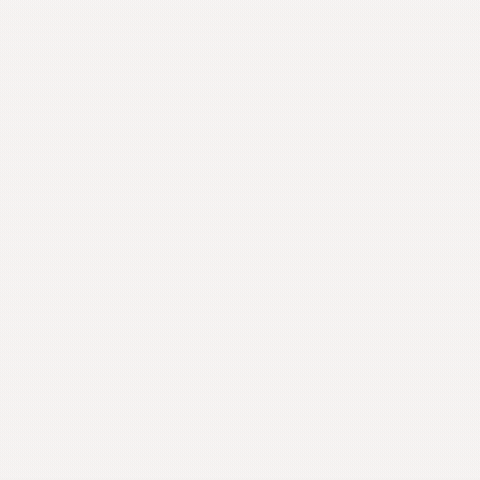

<!-- ============================================================= -->
<!-- PROFILE README — goes in the repo named exactly "Mohamed".     -->
<!-- Copy the whole /assets folder into that repo.                  -->
<!-- Fill the two [BRACKETS] (LinkedIn + email). Delete this block. -->
<!-- ============================================================= -->

  

<h1 align="center">Hi, I'm Mohamed</h1>

<h3 align="center">Full-Stack Web Developer</h3>

  <b>I build fast, secure, and reliable web applications for businesses and founders 
  who want software that actually works in production — not just on a demo screen.</b>

  
  &nbsp;
  
  &nbsp;
  

<h2> What I do</h2>

I design and build complete web applications end to end — from the database to the interface — and hand over work that's ready to ship.

- **Custom web apps** — dashboards, booking systems, internal tools, SaaS products
- **Modern websites** — fast, responsive, and built to convert visitors into customers
- **Full ownership** — I take a project from idea to a deployed, working product

<h2> My stack</h2>

I work primarily with the **MERN stack**, which lets me build and ship complete, scalable applications efficiently.

  
  
  
  

Plus everything around it — REST APIs, authentication, integrations, and deployment.

<h2> How I deliver proper work</h2>

- **Performance-first** — I optimize load times, database queries, and rendering so your app stays fast as it scales.
- **Security by default** — proper authentication, input validation, and protection against common vulnerabilities — built in, not bolted on.
- **Clean, maintainable code** — so your project can be extended later without starting from scratch.
- **Clear communication** — you'll always know what's being built and where things stand.

 

<h2> Let's work together</h2>

I'm currently available for freelance projects.

  
  
  

<i>Have a project in mind? Reach out — I'd like to hear what you're building.</i>
